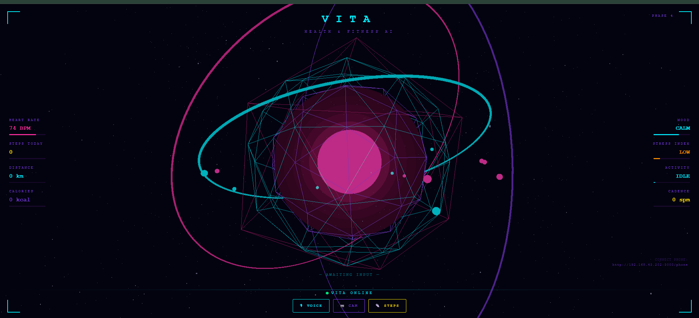
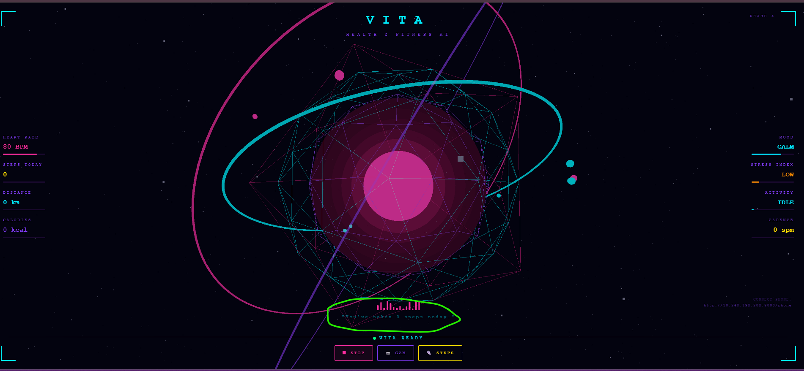
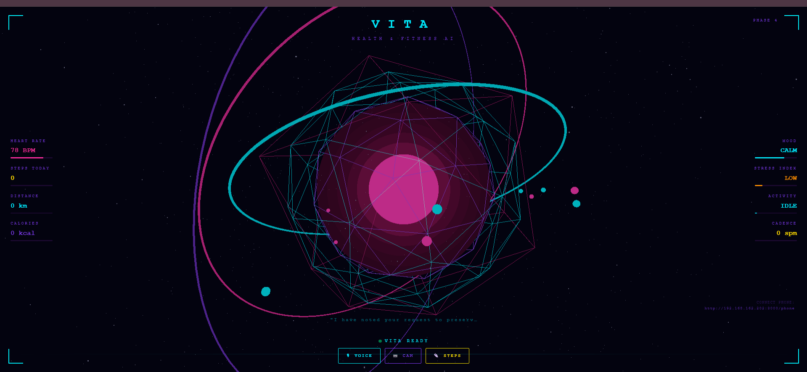

🔮 VITA

Personal Health & Fitness AI

A real-time, voice-first health companion that connects AI, live phone telemetry, computer vision, and an interactive 3D interface.

  
  
  
  
  
  
  

  <a href="#-what-is-vita">Overview</a> •
  <a href="#-architecture">Architecture</a> •
  <a href="#-features">Features</a> •
  <a href="#-quick-start">Quick Start</a> •
  <a href="#-demo-flow">Demo</a>

👁️ See VITA

  

  
  

The key idea: VITA is not just an LLM wrapper. It is a real-time application that combines voice, live device data, controlled AI tools, and an interactive UI.

🧠 What is VITA?

VITA is a state-aware personal health and fitness AI assistant.

It can:

listen for a wake phrase and hold a multi-turn voice conversation;

transcribe speech in real time;

query live VITA fitness state through controlled tools;

respond using neural text-to-speech;

receive live step/activity telemetry from a phone;

react visually to activity, voice amplitude, mood, and connection state.

⚡ Features

Capability

What it does

🎙️ Wake + Voice

Wake phrase, live transcription, multi-turn conversation

🧠 AI Agent

Gemini-based routing with controlled application tools

🔊 Neural TTS

Spoken responses through ElevenLabs

📱 Live Fitness

Phone accelerometer → step detection → laptop dashboard

🔌 Realtime Sync

WSS channel for phone/laptop state synchronization

📷 Computer Vision

Face-expression detection with a safe fallback mode

🔮 3D HUD

Three.js orb reacts to voice, activity, mood, and state

🛡️ Guardrails

Live measurements are read from application state instead of invented

🏗️ Architecture

                 ┌─────────────────────────────┐
                 │          VITA UI             │
                 │       Next.js + React        │
                 └─────────────┬───────────────┘
                               │
          ┌────────────────────┼────────────────────┐
          │                    │                    │
          ▼                    ▼                    ▼
       🎙 VOICE             📱 PHONE             📷 CAM
          │                    │                    │
       Live STT          DeviceMotionEvent     face-api.js
          │                    │                    │
          │                StepDetector        Mood state
          │                    │                    │
          └─────────────┬──────┴────────────────────┘
                        ▼
                ┌─────────────────┐
                │   VITA State    │
                └────────┬────────┘
                         ▼
                  Intent Router
                         ▼
                 Gemini Agent
                         │
                ┌────────┴────────┐
                ▼                 ▼
            Tool calls        Direct answer
                │                 │
                └────────┬────────┘
                         ▼
                   ElevenLabs
                         ▼
                       🔊 TTS

Two realtime channels, two responsibilities

PHONE WSS
Phone telemetry
      ↓
VITA application state
      ↓
Dashboard + AI tools

LIVE STT WS
Microphone audio
      ↓
Live transcription
      ↓
/api/agent
      ↓
Gemini
      ↓
ElevenLabs
      ↓
Audio response

The detailed sequence diagram is in ARCHITECTURE.md.

🎙️ Voice Pipeline

"Hello Vita"
     ↓
Wake phrase accepted
     ↓
Session ACTIVE
     ↓
Live STT WebSocket
     ↓
Final transcript
     ↓
/api/agent
     ↓
Intent Router
     ↓
Gemini + controlled tools
     ↓
Verified application state / answer
     ↓
/api/speak
     ↓
ElevenLabs
     ↓
🔊 Audio playback
     ↓
Next conversational turn

VITA supports natural STOP commands such as:

"Vita stop"
"Vita stop now"
"Okay, Vita, stop now"
"Thanks, Vita, stop now"
"Goodbye Vita"

📱 Phone Sensor Pipeline

Phone browser
     ↓
/phone
     ↓
DeviceMotionEvent
     ↓
StepDetector
     ↓
steps / cadence / activity / distance / calories
     ↓
WSS → /vita-ws
     ↓
Laptop VITA
     ↓
HUD + AI state

The phone sends structured realtime events including:

phone_ready
tracking_started
steps
tracking_stopped

🧰 AI Tools

VITA exposes a deliberately small, controlled tool surface:

Tool

Purpose

get_step_count

Read current steps from live VITA state

get_vita_state

Read current fitness, activity, mood, sensor, and session state

set_step_tracking

Start/stop step tracking only when explicitly requested

The agent is instructed to distinguish measured state from estimates and to never invent unavailable health measurements.

🧩 Tech Stack

Frontend

Next.js · React · TypeScript · Three.js · Tailwind CSS

AI / Voice

Google Gemini · Gemini Live Transcription · ElevenLabs TTS

Realtime / Device

WebSocket / WSS · DeviceMotionEvent · AudioWorklet · face-api.js

Backend

Node.js · Next.js API Routes · ws · Custom HTTPS server

🔐 Why HTTPS + WSS?

The phone sensor workflow relies on browser capabilities that are restricted to secure contexts.

For local LAN testing, VITA uses a locally trusted HTTPS certificate created with mkcert:

https://localhost:3000
https://<LAPTOP-LAN-IP>:3000/phone

The same secure origin is used for the phone/laptop WSS connection.

🚀 Quick Start

1. Install

npm install

2. Create local certificates

Install mkcert, then:

mkcert -install
mkcert -key-file certs/vita-key.pem -cert-file certs/vita-cert.pem 192.168.162.202 localhost 127.0.0.1

Use your current laptop LAN IP if it changes.

3. Configure secrets

Create .env.local with the API credentials required by your configured VITA backend.

Never commit .env.local, private keys, or local certificates.

4. Build

On Windows:

$env:NODE_OPTIONS="--max-old-space-size=4096"
npm run build

5. Start production mode

$env:NODE_ENV="production"
node server.js

Open:

Laptop → https://localhost:3000
Phone  → https://<LAPTOP-LAN-IP>:3000/phone

🎬 Demo Flow

A clean mentor/interview demonstration:

1. Open VITA
2. Show PHONE LINKED
3. Start phone tracking
4. Walk for a few seconds
5. Show steps / cadence / activity updating
6. Say "Hello Vita"
7. Ask "What is my step count today?"
8. Ask "What is my current activity?"
9. Ask a general fitness question
10. Say "Thanks, Vita, stop now."

What this demonstrates

Device telemetry
      ↓
Realtime transport
      ↓
Application state
      ↓
AI tool routing
      ↓
LLM response
      ↓
Neural TTS
      ↓
Conversational UX

✅ Current Status

System

Status

Next.js / React UI

✅

Three.js HUD

✅

Wake phrase

✅

Browser audio unlock

✅

Live STT

✅

Gemini agent

✅

Controlled tools

✅

ElevenLabs TTS

✅

Multi-turn voice

✅

STOP commands

✅

Phone DeviceMotion

✅

StepDetector

✅

Phone → Laptop WSS

✅

Local HTTPS

✅

Production build

✅

Camera / mood detection

✅

🧪 Engineering Highlights

Realtime-first architecture
Phone telemetry is pushed through WebSockets instead of repeatedly polling.

State-aware AI
The agent can query live application state and invoke explicitly supported tools.

Separation of concerns
Phone telemetry and Live STT use independent realtime channels.

Defensive voice flow
Silence detection, reconnect behavior, TTS tracking, cleanup, and explicit STOP handling keep the interaction resilient.

Browser-aware voice UX
A one-time user gesture unlocks browser audio without removing the wake-word experience.

⚠️ Current Limitations

This repository represents a local portfolio / demonstration architecture, not an internet-facing production deployment.

Laptop and phone must be able to reach each other over the local network/hotspot.

The development HTTPS certificate must be trusted by the test device.

Browser permissions vary across platforms.

The displayed heart-rate value is a simulated UI value, not a medical measurement.

Camera mood detection depends on camera access and model availability.

LLM/TTS latency depends on network and upstream provider response times.

🔭 Future Engineering

Persistent user accounts and longitudinal fitness history

Cloud-backed analytics

Authenticated device pairing

Scalable WebSocket infrastructure

Observability and distributed tracing

Streamed / lower-latency model responses

Wearable and real heart-rate integrations

Automated AI evaluation and regression testing

👨‍💻 Built By

Aman Tiwari

AI / Full-Stack Engineering · Generative AI · Real-time Systems

Built as a hands-on exploration of what happens when an LLM becomes one component inside a real application.

⭐ Explore the architecture. Run the demo. Inspect the code.

VITA Repository

